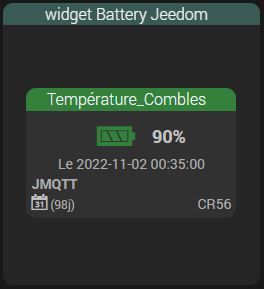
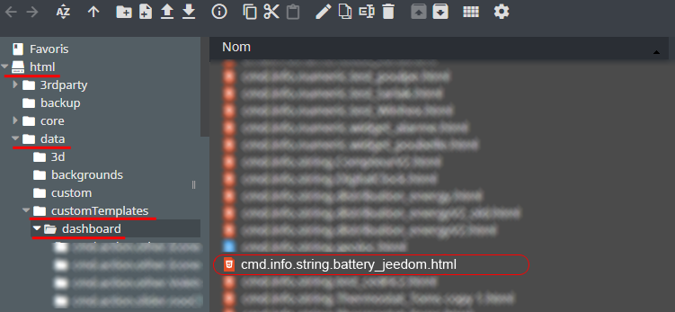
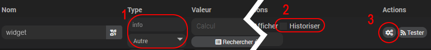
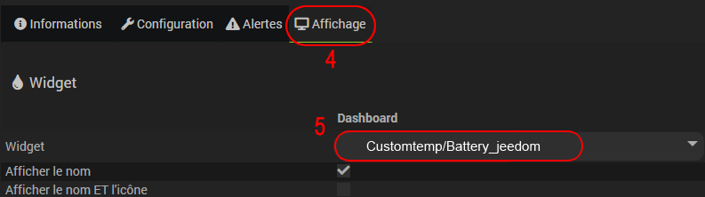
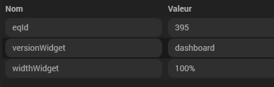

# Widget Battery Jeedom

## 1) Téléchargement du Widget
- Fichier source à récupérer sous :
  - /widgets_perso/Battery_jeedom/cmd.info.string.battery_jeedom.html
(Si vous ne savez pas comment télécharger un fichier sur Github, lisez cette [section](https://github.com/Phpvarious/Widgets_perso/blob/B%C3%AAta/HowToDownload.md))
- Puis déposer ce fichier dans le dossier :
  - /html/data/customTemplates/dashboard/

 

## 2) Création d'un virtuel
- Ajoutez une commande Info/Autre, puis sauvegarder (1).
- Attention, ne pas historiser (2).
- Associez le widget à la commande Info/Autre,(3, 4 et 5).

## 3) Paramètres.

     eqId : [Numérique] - 	OBLIGATOIRE : Id de l'équipement à afficher, attention celui-ci doit être disponible dans Analyse/Equipements.
	 versionWidget : [mobile ou dashboard] - 	version à afficher. [Défaut : mobile]
     widthWidget : [Autre] - Largueur de la tuile, mettre 100% si vous voulez qu'il s'adapte a la tuile.. [Défaut : 210px]
	  
- Exemple de paramètres optionnels :

