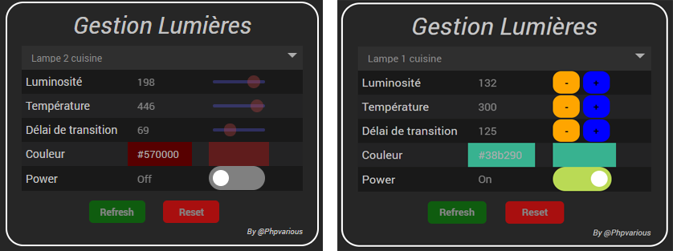
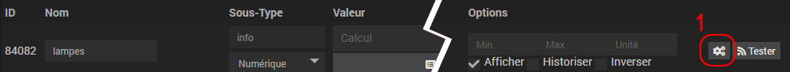
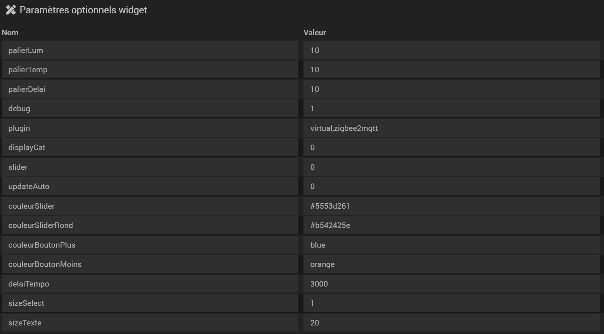

# Widget Gestion lumières.

## 1) Téléchargement du fichier.
- Fichier source à récupérer sous :
  - /jeedom_widgets/Gestion Lumières/cmd.info.numeric.gestion_lumieres.html
- Puis déposer ce fichier (avec JeeXplorer ...) dans le dossier :
  - /html/data/customTemplates/dashboard/
 
 

## 2) Création d'un virtuel avec commande info numérique.

## 3) Associer le widget à la commande info. (créée précédemment)

## 4) Paramètres Optionnels.

     palierLum : [Numérique] - 	Palier pour l'augmentation/diminution de la luminosité. [Défaut : 17]
     palierTemp : [Numérique] - 	Palier pour l'augmentation/diminution de la température. [Défaut : 50]
     palierDelai : [Numérique] - 	Palier pour l'augmentation/diminution du délai de transition. [Défaut : 50]
	 plugin :			Liste des plugins pour l'import des équipements sans espace, séparés par une virgule (,) Exemple : virtual,zigbee2mqtt
     displayCat : [Binaire] -   	Permet d'afficher une séparation entre les plugins dans la liste déroulante.[Défaut : 0]
     slider : [Binaire] -       	Affiche un slider à la place des boutons.[Défaut : 0 donc mode  bouton]
     couleurSlider :            	Couleur de la barre des sliders. Exemple : white, #ffffff ..... [Défaut : white]
     couleurSliderRond :        	Couleur du rond des sliders. Exemple : white, #ffffff ..... [Défaut : white]
     couleurBoutonPlus :        	Couleur du bouton + . Exemple : white, #ffffff ..... [Défaut : aliceblue]
     couleurBoutonMoins :       	Couleur du bouton - . Exemple : white, #ffffff ..... [Défaut : aliceblue]
	 sizeSelect : [Numérique] -     Nombres d'éléments affichés dans la liste de sélection (non déroulé).[Défaut : 1]
	 sizeTexte : [Numérique] -      Taille du texte affiché dans la liste de sélection.[Défaut : 13]
     delaiTempo : [Numérique] - 	Temporisation pour le refresh des valeurs du widget après avoir exécuté une commande sur celui-ci.
	 Attention valeur en ms soit 5000 pour 5s.[Défaut : 700]
     debug : [Binaire] - 		Passe le Widget en mode Debug. [Défaut : 0]
	 Ne pas oublier d'allonger le widget vers le bas pour afficher le mode debug
	 updateAuto : [Binaire] - 	ATTENTION pour que ce mode fonctionne correctement, votre Widget ne doit pas être affiché sur la même page que votre équipement, sinon les commandes états de votre équipement ne seront pas refresh.
	 Ce mode désactive la tempo 'delaiTempo' et le widget se met à jour automatiquement lorsqu'un événement est remonté sur l'équipement. [Défaut : 0]
	 
- Exemple de paramètres optionnels :

## 5) Paramétrage des équipements.
Votre équipement doit être 'Activer' et catégorisé 'Lumière'.

Veuillez à bien paramétrer les Min et Max de vos commandes Action dans vos équipements.

 
## Compatibilité.
le widget est nativement compatible avec ces plugins :

- Virtuel (virtual)
  - à condition d'utiliser les noms de commmandes [ci-dessus](#nomcommande).
  - ou, si l'import a été effectué à partir des plugins ci-dessous.
- ZigbeeLinker (zigbee2mqtt)
- Zigbee (zigbee)
- Philips Hue (philipsHue)
- Xiaomi home (xiaomihome)
  - un temps de réponse important a été constaté sur ce plugin, n'hésitez pas à augmenter la tempo (delaiTempo) à 3000 si vous constatez un comportement anormal lors d'une action sur le widget.

## Nom des commandes.

- Pour que le widget fonctionne correctement il y un standard dans les noms des commandes de votre équipement à respecter !

  - Power on : on, on1, allumer.
  - Power off : off, off1, eteindre.
  - Power état : state, etat, statut.
  - Luminosité état : etat luminosite, luminosite info, luminosite (valeur), luminosite etat, luminosite anneau.
  - Luminosité cde : luminosite, definir luminosite.
  - Couleur état : etat couleur, couleur etat, couleur rgb, couleur (valeur), couleur anneau.
  - Couleur cde : couleur, definir couleur rgb, definir couleur.
  - Durée/transition cde : duree, transition.
  - Durée/transition état : etat duree, duree etat, transition statut,statut transition, transition status, status transition.
  - Température couleur : temperature couleur, temperature de blanc, couleur temp, temperature.
  - Température couleur état : etat temperature couleur, etat couleur temp, temperature de blanc info, temperature couleur (valeur).

- Les noms de commandes sont insensibles aux majuscules, l'underscore (_), et caractère (é).
  - Exemple 1 : Etat_duree -> [OK]
  - Exemple 2 : Couleur_état ->  [OK]
  
## Debug

     Le Widget dispose d'un mode debug (debug = 1), celui-ci a pour effet d'ajouter du contenu en dessous de votre widget
	 Ne pas oublier d'allonger votre virtuel sur le Dashboard pour visualiser ces informations.
	 

Dans l'exemple ci-dessus, on peut constater que la ligne "Luminosité" (1) n'est pas entièrement verte.  
Le widget n'a pas réussi à trouver la commande Info (état) de la luminosité et donc ne peut activer le slider (2).
- 2 raisons possibles :
  - Votre équipement ne gère tout simplement pas cette commande.
  - Le nom de la commande ne correspond pas au [standard compatible](#nomcommande) avec le widget.
