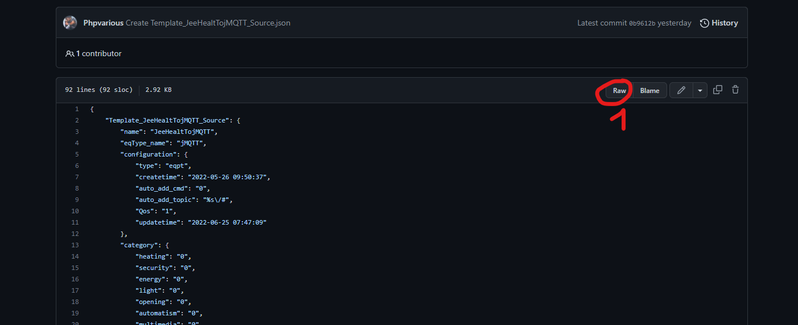

# Comment telecharger un fichier.

Voici un exemple pour telecharger ce fichier "[cmd.info.string.JeeHealtTojMQTT](JeeHealtTojMQTT/cmd.info.string.JeeHealtTojMQTT.html)"

Vous arriverez sur cette page, il vous suffira de cliquer sur le bouton "Raw".

Ensuite dans la fenêtre suivante, faites un clic droit, puis "Enregistrer sous"

Le nom de fichier ainsi que sont extension seront automatiquement crées, il suffira juste de confirmer.

