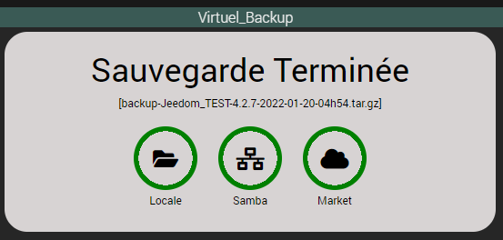
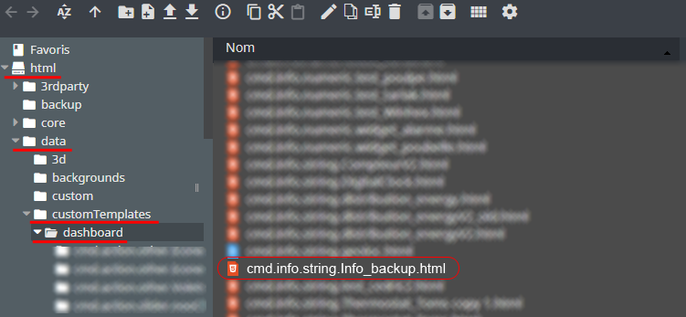
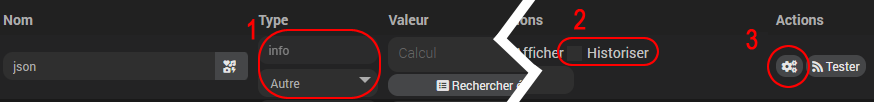
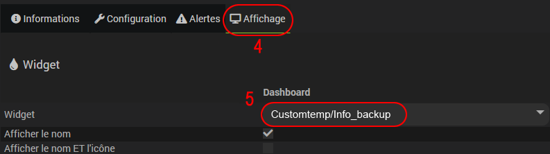
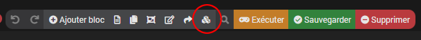
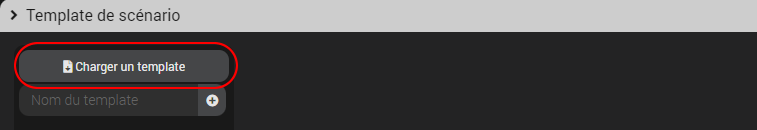
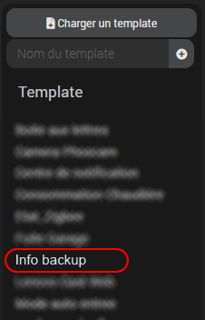
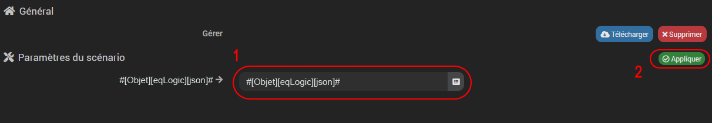
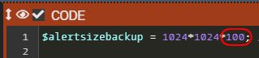

# Widget Info backup

- Informations disponibles sur le widget :
  - Etat de la sauvegarde local.
  - Etat de la sauvegarde samba (si activée).
  - Etat de la sauvegarde market (si activée).
  - Nom de la sauvegarde.

## 1) Téléchargement du Widget
- Fichier source à récupérer sous :
  - /widgets_perso/Info_backup/cmd.info.string.Info_backup.html
- Puis déposer ce fichier (avec JeeXplorer ...) dans le dossier :
  - /html/data/customTemplates/dashboard/
 
 

## 2) Création d'un virtuel
- Ajoutez une commande Info/Autre, puis sauvegarder (1).
- Attention, ne pas historiser (2).
- Associez le widget à la commande Info/Autre,(3, 4 et 5).

- Paramètres Optionnels :

     couleurBackground : Couleur d'arrière plan - Exemple : white, #ffffff ..... [Défaut : #7c4848]
     couleurText : Couleur du texte - Exemple : white, #ffffff ..... [Défaut : #c3c3c3]
     styleLoader : style de logo "loading" - Exemple : 1, 2, 3, 4. [Défaut : 1]
     couleurLoader : Couleur du logo "loading" - Exemple : white, #ffffff ..... [Défaut : #c3c3c3]
     couleurIcones : Couleur des icones - Exemple : white, #ffffff ..... [Défaut : white]
     couleurCircleSucces : Couleur du cercle en cas de succès - Exemple : white, #ffffff ..... [Défaut : green]
     couleurCircleError : Couleur du cercle en cas d'erreur - Exemple : white, #ffffff ..... [Défaut : red]

## 3) Création du scénario

- Fichier source à télécharger :
  - /widgets_perso/Info_backup/Info backup.json
  
- une fois le fichier téléchargé crééz un nouveau scénario puis ajouter un template :

- Selectionnez "Charger un template" puis ajoutez le fichier téléchargé précedemment (Info du jour.json):

- Une fois chargé, celui-ci devrait apparaître dans le menu de gauche, cliquez dessus :

- Dans la nouvelle fenêtre :
  - Recherchez le virtuel créé précedemment (1).
  - Appliquez les modifications (2).
  - Demande de confirmation, cliquez sur OK puis sauvegardez le scénario.

## 4) Configuration
Une fois toutes ces étapes accomplies, ouvrez le scénario et modifiez, DANS LE SECOND BLOC CODE ,la taille mini de la sauvegarde en octet pour déclencher une erreur. [Défaut : 100Mo]

## 5) Options

Il est possible d'extraire plus d'informations du scénario :

| Tag scénario | subType | Désignation | Valeurs |
|---|---|---|---|
| tag(action) | Autre| Etape de la sauvegarde| startBackup, endBackup |
| tag(errorScenario) | Binaire | Erreur dans le scenario | 0-->ok, 1-->erreur |
| tag(errorLog) | Binaire | Erreur dans le log | 0-->ok, 1-->erreur |
| tag(errorLocal) | Binaire | Etat backup local | 0-->ok, 1-->erreur |
| tag(errorSize) | Binaire | Erreur taille de la backup | 0-->ok, 1-->erreur |
| tag(errorSamba) | Binaire | Etat backup samba | 0-->ok, 1-->erreur, -1-->Désactivé |
| tag(errorMarket) | Binaire | Etat backup market | 0-->ok, 1-->erreur, -1-->Désactivé |

