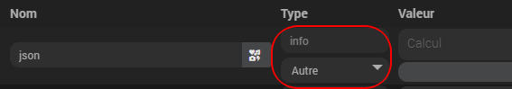

# Widget Info du jour.

## 1) Téléchargement du Widget.
- Fichier source à récupérer sous :
  - /widgets_perso/Info_du_jour/cmd.info.string.Info_du_jour.html
- Puis déposer ce fichier (avec JeeXplorer ...) dans le dossier :
  - /html/data/customTemplates/dashboard/
 
 

## 2) Création d'un virtuel avec commande info Autre.

## 3) Associer le widget à la commande info. (créée précédemment)

## 4) Paramètres Optionnels.

     couleurText :       	Couleur du texte - . Exemple : white, #ffffff ..... [Défaut : #c3c3c3]
	 
- Exemple de paramètres optionnels :

 
 
