# Widget Info du jour

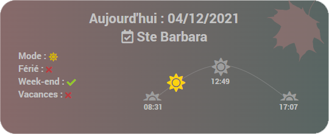

- Informations disponibles sur le widget :
  - Date du jour.
  - Saint du jour (et du lendemain au survol).
  - Mode Jour/nuit (changement de couleur du Background).
  - Férié (prochain jour férié au survol).
  - Week-end.
  - Vacances (prochaines vacances au survol).
  - Lever/coucher du soleil (avec animation de l'élévation en cours).
  - Saison (représentée par l'image en haut à droite).

## 1) Téléchargement du Widget
- Fichier source à récupérer sous :
  - /widgets_perso/Info_du_jour/cmd.info.string.Info_du_jour.html
- Puis déposer ce fichier (avec JeeXplorer ...) dans le dossier :
  - /html/data/customTemplates/dashboard/
 
 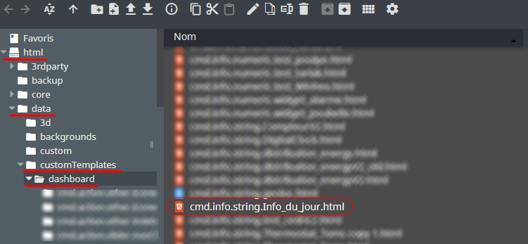

## 2) Création d'un virtuel
- Ajoutez une commande Info/Autre, puis sauvegarder (1).
- Attention, ne pas historiser (2).
- Associez le widget à la commande Info/Autre,(3, 4 et 5).

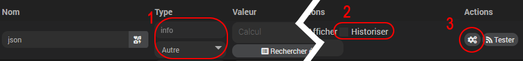
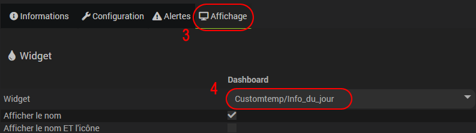

- Paramètre Optionnel :

     borderRadius :         Taille arrondi du widget - Exemple : 10, 20 ...  [Défaut : 30]
	 couleurText :       	Couleur du texte - . Exemple : white, #ffffff ..... [Défaut : #c3c3c3]
	 couleurBackground :    Couleur du dond - Exemple : #fffff, white ...
	 saisonText :           Affiche/cache le texte saison - 1=Afficher, 0=cacher [défaut : 0]
	 saisonLogo :           Affiche/cache le logo saison - 1=Afficher, 0=cacher [défaut : 1]

## 3) Création du scénario

- Fichier source à télécharger :
  - /widgets_perso/Info_du_jour/Info du jour.json
  
- une fois le fichier téléchargé crééz un nouveau scénario puis ajouter un template :

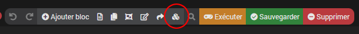

- Selectionnez "Charger un template" puis ajoutez le fichier téléchargé précedemment (Info du jour.json):

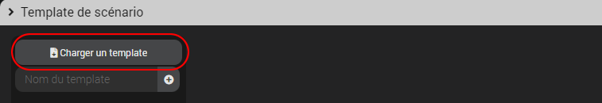

- Une fois chargé, celui-ci devrait apparaître dans le menu de gauche, cliquez dessus :

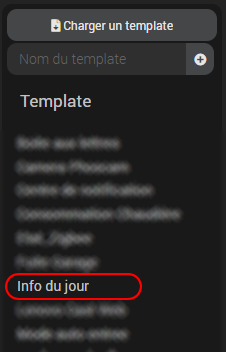
- Dans la nouvelle fenêtre :
  - Recherchez le virtuel créé précedemment (1).
  - Appliquez les modifications (2).
  - Demande de confirmation, cliquez sur OK puis sauvegardez le scénario.

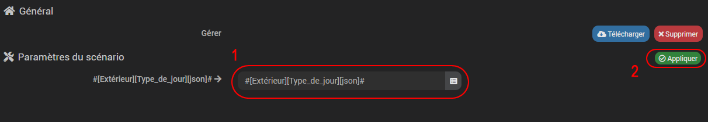

Le scénario a un CRON de cinq minutes par défaut.

## 4) Configuration
Une fois toutes ces étapes accomplies, ouvrez le scénario et modifiez la zone vous concernant pour les vacances scolaires.

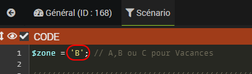

Ensuite configurez la zone géographique dans la configuration Jeedom :
- Rendez-vous dans Réglages/Sytème/Configuration.
- Puis dans l'onglet général, en bas renseignez les informations :

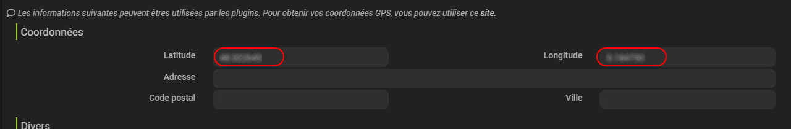

## 5) Options

Il est possible d'extraire plus d'informations du scénario, il faudra créer de nouvelles actions (event) dans celui-ci et ajouter des infos dans votre virtuel :

|Tag scénario|Type Info virtuel|Détail|
|---|---|---|
|tag(leverSoleilScenario)|Numérique|Exemple : 831 (8h31)
|tag(zenithSoleilScenario)|Numérique|Exemple : 1249 (12h49) |
|tag(coucherSoleilScenario)|Numérique|Exemple : 1707 (17h07) |
|tag(saintJour)|Autre| Saint du jour|
|tag(saintDemain)|Autre| Saint du lendemain|
|tag(daynumber)|Numérique| |
|tag(modeJourBinaire)|Binaire|1=Jour|
|tag(ferie)|Binaire| 1=Férié|
|tag(weekend)|Binaire| 1=WE|
|tag(saison)|Autre| Printemps/Eté...|
|tag(vacancesEnCours)|Binaire| 1=Vacances|

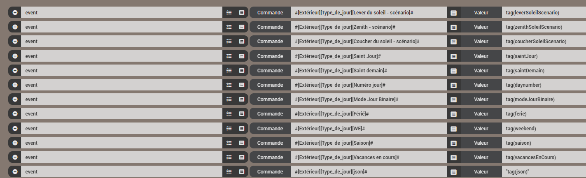

