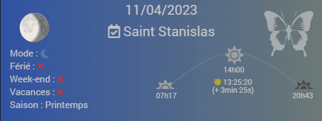
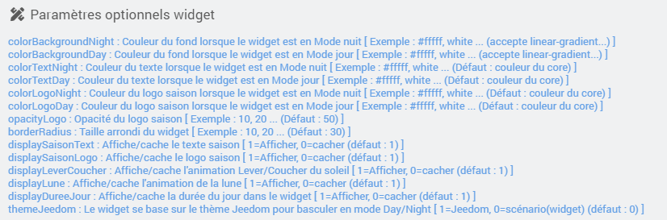
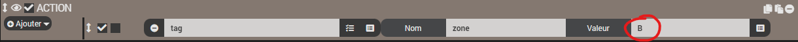

# Widget Info du jour

- Informations disponibles sur le widget :
  - Date du jour.
  - Saint du jour (et du lendemain au survol).
  - Mode Jour/nuit (changement de couleur du Background).
  - Férié (prochain jour férié au survol).
  - Week-end.
  - Vacances (prochaines vacances au survol).
  - Lever/coucher du soleil (avec animation de l'élévation en cours).
  - Saison (représentée par l'image en haut à droite).

## 1) Téléchargement du Widget
- Fichier source à récupérer sous :
  - /widgets_perso/Info_du_jour/cmd.info.string.Info_du_jour.html
- Puis déposer ce fichier (avec JeeXplorer ...) dans le dossier :
  - /html/data/customTemplates/dashboard/
 
 

## 2) Création d'un virtuel
- Ajoutez une commande Info/Autre, puis sauvegarder (1).
- Attention, ne pas historiser (2).
- Associez le widget à la commande Info/Autre,(3, 4 et 5).

********** Widget en version mobile *******************
- Fichier source à récupérer sous :
  - /widgets_perso/Info_du_jour/mobile/cmd.info.string.Info_du_jour.html
- Puis déposer ce fichier (avec JeeXplorer ...) dans le dossier :
  - /html/data/customTemplates/mobile/
********************************************************

## Paramètres Optionnels :

## 3) Création du scénario

- Fichier source à télécharger :
  - /widgets_perso/Info_du_jour/Info du jour.json
  
- une fois le fichier téléchargé crééz un nouveau scénario puis ajouter un template :

- Selectionnez "Charger un template" puis ajoutez le fichier téléchargé précedemment (Info du jour.json):

- Une fois chargé, celui-ci devrait apparaître dans le menu de gauche, cliquez dessus :

- Dans la nouvelle fenêtre :
  - Recherchez le virtuel créé précedemment (1).
  - Appliquez les modifications (2).
  - Demande de confirmation, cliquez sur OK puis sauvegardez le scénario.

Le scénario a un CRON de cinq minutes par défaut.

## 4) Configuration
Une fois toutes ces étapes accomplies, ouvrez le scénario et modifiez la zone vous concernant pour les vacances scolaires.

Ensuite configurez la zone géographique dans la configuration Jeedom :
- Rendez-vous dans Réglages/Sytème/Configuration.
- Puis dans l'onglet général, en bas renseignez les informations :

## 5) Options

Il est possible d'extraire plus d'informations du scénario, il faudra créer de nouvelles actions (event) dans celui-ci et ajouter des infos dans votre virtuel :

### VACANCES SCOLAIRE

| Tag scénario | Type Info virtuel | Détail |
| ------ | ------ | ------ |
| tag(vacancesEnCours) | Binaire | 1=Vacances |
| tag(vacancesEnCoursLibelle) | Autre | Ex : Vacances de la Toussaint |
| tag(debutVacancesEnCours) |Autre | Ex : 2022-10-22 |
| tag(finVacancesEnCours) | Autre | Ex : 2022-11-07 |
| tag(vacancesPochainesLibelle) | Autre | Ex : Vacances de la Toussaint |
| tag(debutVacancesProchaines) | Autre | Ex : 2022-10-22 |
| tag(finVacancesProchaines) | Autre | Ex : 2022-11-07 |
| tag(nbProchainesVacances) | Numérique | Ex : 34 (34 jours) |

### SAINT DU JOUR

| Tag scénario | Type Info virtuel | Détail |
| ------ | ------ | ------ |
| tag(saintJour) | Autre | Saint du jour |
| tag(saintDemain) | Autre| Saint du lendemain |

### JOUR

| Tag scénario | Type Info virtuel | Détail |
| ------ | ------ | ------ |
| tag(dateDuJour) | Autre | Ex : 2022-09-18 |
| tag(daynumber) | Numérique | |
| tag(weekend) | Binaire | 1=WE |
| tag(ferie) | Binaire | 1=Férié |
| tag(libelleFerie) | Autre | Ex : Toussaint |
| tag(dateProchainFerie) | Autre | Ex : 2022-11-01 |
| tag(libelleProchainFerie) | Autre| Ex : Toussaint |
| tag(nbProchainFerie) | Numérique | Ex : 44 (44jours restant avant prochain jour férié |
| tag(saison) |Autre | Printemps/Eté... |

### SOLEIL

| Tag scénario | Type Info virtuel | Détail |
| ------ | ------ | ------ |
| tag(leverSoleilScenario) | Numérique | Exemple : 831 (8h31) |
| tag(zenithSoleilScenario) | Numérique | Exemple : 1249 (12h49) |
| tag(coucherSoleilScenario) | Numérique | Exemple : 1707 (17h07) |
| tag(aubeCivil)| Numérique | Exemple : 831 (8h31) |
| tag(crepusculeCivil) | Numérique | Exemple : 1707 (17h07) |
| tag(aubeNautique) | Numérique | Exemple : 831 (8h31) |
| tag(crepusculeNautique) | Numérique | Exemple : 1707 (17h07) |
| tag(aubeAstronomique) | Numérique | Exemple : 831 (8h31) |
| tag(crepusculeAstronomique) | Numérique | Exemple : 1707 (17h07) |
| tag(elevation) | Numérique | |
| tag(elevationZenith) | Numérique | |
| tag(dureeJour)| Autre | Exemple : 15:10:51 (hh:mm:ss) |
| tag(dureeJourSeconde) |  Numérique | Exemple : 41203
| tag(dureeJourEcart) | Autre | Exemple : -207 (-207 secondes) |
| tag(modeJourBinaire) | Binaire | 1=Jour |
| tag(modeJour) | Autre | Jour ou Nuit |

### LUNE

| Tag scénario | Type Info virtuel | Détail |
| ------ | ------ | ------ |
| tag(Moon_Phase) | Autre | Croissante ou Décroissante |
| tag(Moon_PhaseName) | Autre | Ex : Premier croissant |
| tag(Moon_Age) | Numérique | Ex : 5.2 |
| tag(Next_Full_Moon) | Autre | Ex : jeudi 06/04/2023 |
| tag(Next_Full_Moon2) | Autre | Ex : vendredi 05/05/2023 |
| tag(Next_New_Moon) | Autre | Ex : jeudi 20/04/2023 |
| tag(Moon_Distance) | Numérique | Ex : 394213 (kms)|
| tag(Moon_Illumination) | Numérique | Ex : 28 (%)|

### Exemple dans le Scénario

