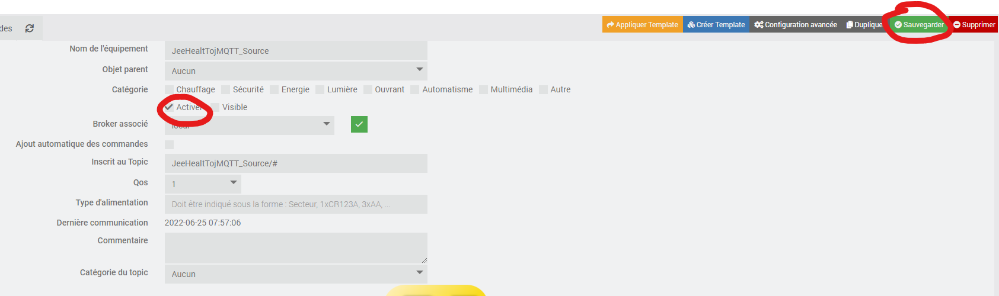

# Widget/scénario JeeHealtTojMQTT

Ce widget/scénario a pour but de gérer son Jeedom "source" par payload a l'aide du plugin jMQTT.
Il est ainsi possible au travers d'un widget, sur un ou plusieurs Jeedom secondaire "cible" de :
 - Consulter / supprimer les messages.
 - Consulter l'état des deamons
 - Démarrer / arrêter les deamons.
 - Mettre à jour un plugin.

Dans ce tuto, tout au long des étapes, je mettrai à disposition les liens vers les éléménts a télécharger.
Pour résumer les éléments a mettre en place :
- Jeedom source :
  - le plugin jMQTT.
  - Un scénario qui se chargera de rassembler les infos (messages, deamon ...) et ainsi les envoyer sur une commande Info du plugin jMQTT qui se chargera de publier sur un broker.
  - Un scénario qui se chargera de lancer les actions (suppression message, redemarrer deamon...).
- Jeedom cible :
  - Le plugin jMQTT.
  - Le widget.

## 1) Installation sur le Jeedom "source".
1) jMQTT
    * Telecharger le template "[Template_JeeHealtTojMQTT_Source](Template_JeeHealtTojMQTT_Source.json)".

      

    * Importer le template dans le plugin jMQTT.

    * Toujours dans le plugin, creer un nouvel équipement sur le broker de votre choix.  Nommer le comme vous le souhaitez, mais pour une meilleur compréhension de ce tuto, je vais le nommer "JeeHealtTojMQTT_Source"

    * Appliquer le template.

    * Choisir le template et saisir le Topic de base "JeeHealtTojMQTT_Source".

    * Activer et sauvegarder l'équipement.

A ce stade, vous devriez avoir un équipement jMQTT de ce type :

Veuillez noter l'id de la comande entourer ci-dessus, vous en aurez besoin pour le scénario suivant.

----------------------------------------------------------------------------------------------

Maintenant nous allons creer les 2 scénarios.

1) Scénario qui permet de publier l'état de jeedom.

## Paramètres Optionnels :

     colorBackgroundNight : Couleur du fond lorsque le widget est en Mode nuit - Exemple : #fffff, white ... (accepte linear-gradient...)
	 colorBackgroundDay :   Couleur du fond lorsque le widget est en Mode jour - Exemple : #fffff, white ... (accepte linear-gradient...)
	 colorTextNight :       Couleur du texte lorsque le widget est en Mode nuit - Exemple : #fffff, white ... [Défaut : #c3c3c3]
	 colorTextDay :         Couleur du texte lorsque le widget est en Mode jour - Exemple : #fffff, white ... [Défaut : #c3c3c3]
	 colorLogoNight :       Couleur du logo saison lorsque le widget est en Mode nuit - Exemple : #fffff, white ... [Défaut : #c3c3c3]
	 colorLogoDay :         Couleur du logo saison lorsque le widget est en Mode jour - Exemple : #fffff, white ... [Défaut : #c3c3c3]
	 opacityLogo :          Opacité du logo saison - Exemple : 10, 20 ... [Défaut : 50 (50%)]
	 borderRadius :         Taille arrondi du widget - Exemple : 10, 20 ...  [Défaut : 30]
	 displaySaisonText :    Affiche/cache le texte saison - 1=Afficher, 0=cacher [défaut : 0]
	 displaySaisonLogo :    Affiche/cache le logo saison - 1=Afficher, 0=cacher [défaut : 1]
	 displayLeverCoucher :  Affiche/cache le div Lever/Coucher du soleil - 1=Afficher, 0=cacher [défaut : 1]
	 themeJeedom :          Le widget se base sur le thème Jeedom pour basculer en mode Day/Night - 1=Jeedom, 0=scénario(widget) [défaut : 0]

## 3) Création du scénario

- Fichier source à télécharger :
  - /widgets_perso/Info_du_jour/Info du jour.json
  
- une fois le fichier téléchargé crééz un nouveau scénario puis ajouter un template :

- Selectionnez "Charger un template" puis ajoutez le fichier téléchargé précedemment (Info du jour.json):

- Une fois chargé, celui-ci devrait apparaître dans le menu de gauche, cliquez dessus :

- Dans la nouvelle fenêtre :
  - Recherchez le virtuel créé précedemment (1).
  - Appliquez les modifications (2).
  - Demande de confirmation, cliquez sur OK puis sauvegardez le scénario.

Le scénario a un CRON de cinq minutes par défaut.

## 4) Configuration
Une fois toutes ces étapes accomplies, ouvrez le scénario et modifiez la zone vous concernant pour les vacances scolaires.

Ensuite configurez la zone géographique dans la configuration Jeedom :
- Rendez-vous dans Réglages/Sytème/Configuration.
- Puis dans l'onglet général, en bas renseignez les informations :

## 5) Options

Il est possible d'extraire plus d'informations du scénario, il faudra créer de nouvelles actions (event) dans celui-ci et ajouter des infos dans votre virtuel :

|Tag scénario|Type Info virtuel|Détail|
|---|---|---|
|tag(leverSoleilScenario)|Numérique|Exemple : 831 (8h31)
|tag(zenithSoleilScenario)|Numérique|Exemple : 1249 (12h49) |
|tag(coucherSoleilScenario)|Numérique|Exemple : 1707 (17h07) |
|tag(saintJour)|Autre| Saint du jour|
|tag(saintDemain)|Autre| Saint du lendemain|
|tag(daynumber)|Numérique| |
|tag(modeJourBinaire)|Binaire|1=Jour|
|tag(ferie)|Binaire| 1=Férié|
|tag(weekend)|Binaire| 1=WE|
|tag(saison)|Autre| Printemps/Eté...|
|tag(vacancesEnCours)|Binaire| 1=Vacances|

