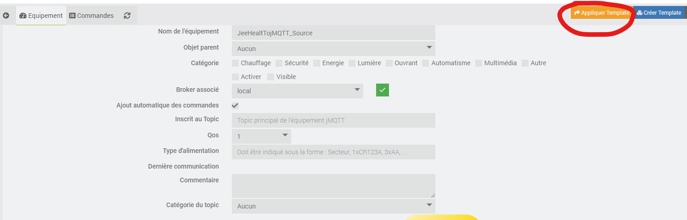
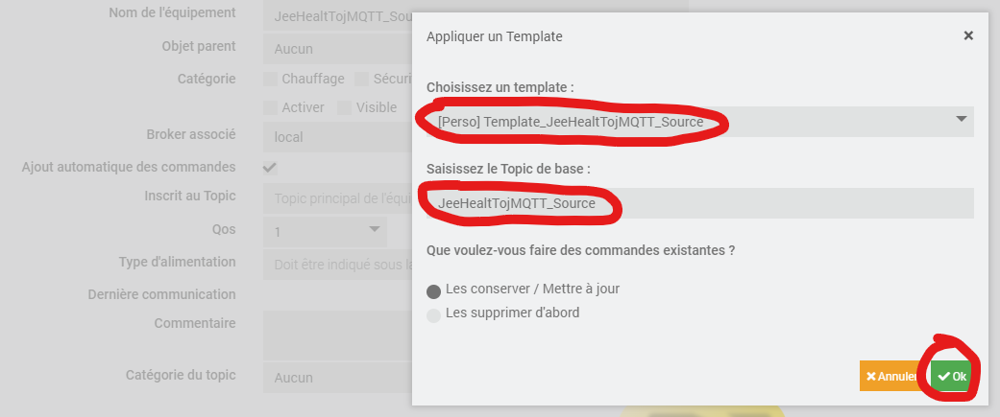

# Widget/scénario JeeHealtTojMQTT

Ce widget/scénario a pour but de gérer son Jeedom "source" par payload a l'aide du plugin jMQTT.  
Il est ainsi possible au travers d'un widget, sur un ou plusieurs Jeedom secondaire "cible" de :
 - Consulter / supprimer les messages.
 - Consulter l'état des deamons
 - Démarrer / arrêter les deamons.
 - Mettre à jour un plugin.

Dans ce tuto, tout au long des étapes, je mettrai à disposition les liens vers les éléménts a télécharger.  
Pour résumé, voici les étapes que nous allons aborder :

- Jeedom source :
  - le plugin jMQTT.
  - Un scénario qui se chargera de rassembler les infos (messages, deamon ...) et ainsi les envoyer sur une commande Info du plugin jMQTT qui se chargera de publier sur un broker.
  - Un scénario qui se chargera de lancer les actions (suppression message, redemarrer deamon...).
- Jeedom cible :
  - Le plugin jMQTT.
  - Le widget.

# 1) Installation sur le Jeedom "source".
## jMQTT
* Telecharger le template "[Template_JeeHealtTojMQTT_Source](Template_JeeHealtTojMQTT_Source.json)".

* Importer le template dans le plugin jMQTT.

     
     

* Toujours dans le plugin, creer un nouvel équipement sur le broker de votre choix. Nommer le comme vous le souhaitez, mais pour une meilleur compréhension de ce tuto, je vais le nommer "JeeHealtTojMQTT_Source" et ensuite appliquer le template précédemment telechargé.
     
	 
	 
     

* Choisir le template et saisir le Topic de base "JeeHealtTojMQTT_Source".

     

* Activer et sauvegarder l'équipement.

     

* A ce stade, vous devriez avoir un équipement jMQTT de ce type :

     

> Veuillez noter l'id de la comande entourer ci-dessus, vous en aurez besoin pour le scénario suivant.

----------------------------------------------------------------------------------------------
## Scénarios

1) Scénario qui permet de publier l'état de jeedom.

     * Telecharger le template scenario "[JeeToJmqttSource_publish](JeeToJmqttSource_publish.json)".
     * Creer un nouveau scénario (JeeToJmqttSource_publish).
	 * Dans celui-ci, importer le template.
	 
	 
	 
	 
	 
	 * Une fois importer ,il devrait apparaitre dans la fenêtre de gauche. cliquer dessus, "Appliquer" puis confirmer sur la fenêtre suivante.
	 
	 
	 
	 * Ouvrez le scénario (1) et modifiez la variable $id_Source(2) en remplacant par l'id notée dans l'étape precedente.
	 
	 
	 
     > Voila pour ce scénario, vous constaterez que le scénario a un CRON 5 donc le payload sera mis à jour toute les 5 minutes, vous pouvez dès a présent faire un test de celui-ci en cliquant sur "Exécuter".
et verifier que tout se passe correctement dans les log de celui-ci.

     

2) Scénario qui permet d'exécuter des actions sur Jeedom.

     * Telecharger le template scenario "[JeeToJmqttSource_action](JeeToJmqttSource_action.json)".
     * Creer un nouveau scénario (JeeToJmqttSource_action).
	 * Dans celui-ci, importer le template.
	 > Je ne re-détail pas les manipulations, car c'est les mêmes que le scénario précèdent.
	 
	 Dans les paramètres de l'import selectionner la commande info créé dans l'étape 1 (jMQTT)
	 
	 
	 
	 > Voila on en a terminé pour ce qui est du Jeedom Source, passons maintenant au la partie "Cible" (widget).

# 2) Installation sur le Jeedom "cible".
 ## jMQTT
* Telecharger le template "[Template_JeeHealtTojMQTT_Cible](Template_JeeHealtTojMQTT_Cible.json)".
* Importer le template dans le plugin jMQTT.
* Toujours dans le plugin, creer un nouvel équipement "JeeHealtTojMQTT_Cible", il faudra bien sur que celui-ci soit sur le même broker que sur le "source".
* Choisir le template (1) et saisir le Topic de base(2) JeeHealtTojMQTT_Source.

     
	 
* Activer et rendre visible l'équipement.

     

 ## Widget
 * Telecharger le widget "[cmd.info.string.JeeHealtTojMQTT](cmd.info.string.JeeHealtTojMQTT.html)".
 * Puis déposer ce fichier dans le dossier `/html/data/customTemplates/dashboard/`
  > Etant donné que dans le template de la commande jMQTT que vous avez mis en place précédemment, est contenu la configuration vers le widget, il normalement pas necessaire d'appliquer le widget a la comande Info "Healt".
  Cependant si ce n'est pas le cas :
  
  
  
  